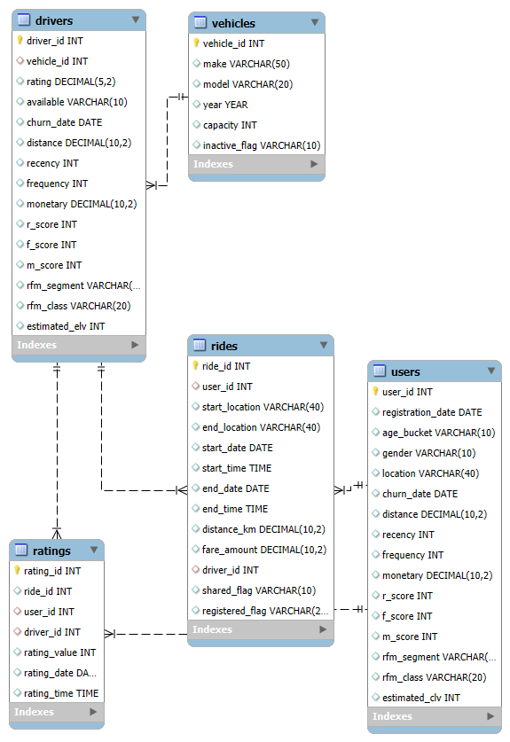

# 🚗 Ride-Share Case Study

## 📚 Contents

- [📌 Project Goal](#-project-goal)
- [📊 Dataset](#-dataset)
- [🧰 Tools Used](#-tools-used)
- [🗂️ Database Setup](#-database-setup)
- [🧪 Data Audit](#-data-audit)
- [🧹 Data Cleaning](#-data-cleaning)
- [🔄 Data Manipulation](#-data-manipulation)
- [🗃️ Cleaned Database](#️-cleaned-database)
- [📄 License](#-license)

## 📌 Project Goal  
This project began with simulated datasets intended for SQL analysis and visualization. During the process, it became evident that the simulated data was too uniform in its distribution to yield meaningful analytical insights.

As a result, the focus of the project shifted toward demonstrating SQL querying, data handling, and cleaning techniques rather than drawing deep analytical conclusions from the dataset. The primary emphasis is now on showcasing SQL skills and portfolio-ready query work.

---

## 📊 Dataset
  
- **Source**: [Kaggle - Ride-Sharing Platform Data](https://www.kaggle.com/datasets/adnananam/ride-sharing-platform-data)  
- **Original Provider**: Simulated Data From Python Faker Library
- **Details**:  
  The data was generated using Python's Faker library and randomized to create a realistic dataset with.

⚠️ *Due to licensing constraints, the dataset is not stored in this repository.*

To replicate:
1. Download from Kaggle.
2. Export the Excel files as a **UTF-8 CSV**.
3. Move the `.csv` to:  
   `C:\ProgramData\MySQL\MySQL Server 8.0\Uploads`

## 🧰 Tools Used

- **Database**: MySQL 8.0
- **Environment**: MySQL Workbench, Tableau Public, 2025.2 & Microsoft Excel (365)

## 🗂️ Database Setup
<details>
<summary>📚 Contents - Database Creation and Importing of Raw Data</summary>

### 1️⃣ Create the Database
```sql
CREATE DATABASE ride_share_case_study;
```

### 2️⃣ Create tables and Import Data
```sql
CREATE TABLE rides (
	ride_id INT,
    user_id INT,
    start_location VARCHAR(40),
    end_location VARCHAR(40),
    ride_start_time DATETIME,
    ride_end_time DATETIME,
    distance_km DECIMAL(10,2),
    fare_amount DECIMAL(10,2),
    driver_id INT
);

LOAD DATA INFILE 'C:/ProgramData/MySQL/MySQL Server 8.0/Uploads/rides.csv'
INTO TABLE rides
FIELDS TERMINATED BY ',' ENCLOSED BY '"'
LINES TERMINATED BY '\n'
IGNORE 1 ROWS
(
  ride_id, user_id, start_location, end_location,
  @ride_start_time, @ride_end_time, distance_km, fare_amount, driver_id
)
SET
  ride_start_time = STR_TO_DATE(@ride_start_time, '%m/%d/%Y %H:%i'),
  ride_end_time   = STR_TO_DATE(@ride_end_time, '%m/%d/%Y %H:%i');

CREATE TABLE users (
    user_id INT,
    registration_date DATETIME,
    age INT,
    gender VARCHAR(10),
    location VARCHAR(40)
);

LOAD DATA INFILE 'C:/ProgramData/MySQL/MySQL Server 8.0/Uploads/users.csv'
INTO TABLE users
FIELDS TERMINATED BY ',' ENCLOSED BY '"'
LINES TERMINATED BY '\n'
IGNORE 1 ROWS(
  user_id, @registration_date, age, gender,
  location
)
SET
  registration_date = STR_TO_DATE(@registration_date, '%m/%d/%Y %H:%i');

CREATE TABLE vehicles (
    vehicle_id INT,
    make VARCHAR(50),
    model VARCHAR(20),
    year YEAR,
    capacity INT
);

LOAD DATA INFILE 'C:/ProgramData/MySQL/MySQL Server 8.0/Uploads/vehicles.csv'
INTO TABLE vehicles
FIELDS TERMINATED BY ',' ENCLOSED BY '"'
LINES TERMINATED BY '\n'
IGNORE 1 ROWS(
  vehicle_id, make, model, year,
  capacity
);

CREATE TABLE drivers (
    driver_id INT,
    vehicle_id INT,
    rating DECIMAL(5,2),
    total_rides INT,
    available VARCHAR(10)
);

LOAD DATA INFILE 'C:/ProgramData/MySQL/MySQL Server 8.0/Uploads/drivers.csv'
INTO TABLE drivers
FIELDS TERMINATED BY ',' ENCLOSED BY '"'
LINES TERMINATED BY '\n'
IGNORE 1 ROWS(
  driver_id, vehicle_id, rating, total_rides,
  available
);

CREATE TABLE ratings (
    rating_id INT,
    ride_id INT,
    user_id INT,
    rating_value INT,
    comments TEXT,
    rating_date DATETIME
);

LOAD DATA INFILE 'C:/ProgramData/MySQL/MySQL Server 8.0/Uploads/ratings.csv'
INTO TABLE ratings
FIELDS TERMINATED BY ',' ENCLOSED BY '"'
LINES TERMINATED BY '\n'
IGNORE 1 ROWS(
  rating_id, ride_id, user_id, rating_value,
  comments, @rating_date
)
SET
  rating_date = STR_TO_DATE(@rating_date, '%m/%d/%Y %H:%i');
```

**Note** Contact information and personal names have been removed from the datasets to support data anonymization best practices. User IDs and driver IDs are retained to enable meaningful analysis without compromising privacy.
</details>

## 🧪 Data Audit
<details>
<summary>📚 Contents – Evaluation of Provided Rideshare Data.</summary>

- [📊 High-Level Overview](#-high-level-overviews)
- [🔁 Detect Duplicates](#-detect-duplicates)
- [⚠️ NULL Value Checks](#️-null-value-checks)
- [🔍 Data Plausibility Checks](#-data-plausibility-checks)
- [🕵️ Evaluate Hidden Flaws](#️-evaluate-hidden-flaws)
- [💤 Inactive Data](#-inactive-data)


### 📊 High-Level Overviews
<details>
<summary>📚 Contents – Baseline Data identifications</summary>

- [🛣️ HO-Rides](#️-ho-rides)
- [🧑 HO-Users](#-ho-users)
- [🚙 HO-Vehicles](#-ho-vehicles)
- [🚖 HO-Drivers](#-ho-drivers)
- [🌟 HO-Ratings](#-ho-ratings)

#### 🛣️ HO-Rides
<details>
<summary>Code</summary>

```sql
SELECT
	COUNT(*) AS total_rides,
    COUNT(DISTINCT start_location) AS unique_starts,
    COUNT(DISTINCT end_location) AS unique_ends,
	MIN(ride_start_time) AS start_date,
    MAX(ride_end_time) AS end_date,
    COUNT(DISTINCT user_id) AS unique_customers,
    COUNT(DISTINCT driver_id) AS unique_drivers,
    SUM(distance_km) AS total_distance,
    SUM(fare_amount) AS total_fare_collected
FROM ride_share_case_study.rides;
```
</details>

|total_rides|unique_starts      |unique_ends        |start_date         |end_date           |unique_customers|unique_drivers|total_distance|total_fare_collected|
|-----------|-------------------|-------------------|-------------------|-------------------|----------------|--------------|--------------|--------------------|
|50000      |25069              |25025              |2024-01-01 00:05:00|2024-10-04 11:44:00|9927            |300           |1276762.04    |2871581.19          |


#### 🧑 HO-Users
<details>
<summary>Code</summary>

```sql
SELECT
	COUNT(DISTINCT user_id) AS total_customers,
    MIN(registration_date) AS earliest_registration,
    MAX(registration_date) AS latest_registration,
    MIN(age) AS youngest_user,
    MAX(age) AS oldest_user,
    COUNT(DISTINCT location) AS unique_locations
FROM ride_share_case_study.users;
```
</details>

|total_customers|earliest_registration|latest_registration|youngest_user|oldest_user|unique_locations|
|---------------|---------------------|-------------------|-------------|-----------|----------------|
|10000          |2020-01-01 01:21:00  |2024-10-04 03:11:00|18           |65         |7787            |

#### 🚙 HO-Vehicles
<details>
<summary>Code</summary>

```sql
SELECT
	COUNT(DISTINCT vehicle_id) AS total_vehicles,
    COUNT(DISTINCT make) AS unique_makes,
    COUNT(DISTINCT model) AS unique_models,
    MIN(year) AS earliest_year,
    MAX(year) AS latest_year,
    MIN(capacity) AS min_capacity,
    MAX(capacity) AS max_capacity
FROM ride_share_case_study.vehicles;
```
</details>

|total_vehicles|unique_makes       |unique_models      |earliest_year|latest_year|min_capacity|max_capacity|
|--------------|-------------------|-------------------|-------------|-----------|------------|------------|
|300           |298                |254                |2000         |2023       |2           |7           |

#### 🚖 HO-Drivers
<details>
<summary>Code</summary>

```sql
SELECT
	COUNT(DISTINCT driver_id) AS total_drivers,
    COUNT(DISTINCT vehicle_id) AS unique_vehicles,
    MIN(rating) AS min_rating,
    MAX(rating) AS max_rating,
    SUM(total_rides) AS total_rides,
    COUNT(CASE WHEN available LIKE '%TRUE%' THEN 1 END) AS total_available,
    COUNT(CASE WHEN available LIKE '%FALSE%' THEN 1 END) AS total_unavailable
FROM ride_share_case_study.drivers;
```
</details>

**Note** It was discovered that the TRUE and FALSE values for availability contain underlying issues that need to be addressed and corrected.

|total_drivers|unique_vehicles    |min_rating         |max_rating|total_rides|total_available|total_unavailable|
|-------------|-------------------|-------------------|----------|-----------|---------------|-----------------|
|300          |189                |1.01               |5.00      |30237      |145            |155              |

#### 🌟 HO-Ratings
<details>
<summary>Code</summary>

```sql
SELECT 
	COUNT(DISTINCT rating_id) AS total_ratings,
    COUNT(DISTINCT user_id) AS unique_customers,
    MIN(rating_value) AS min_rating,
    MAX(rating_value) AS max_rating,
    COUNT(DISTINCT comments) AS unique_comments,
    MIN(rating_date) AS earliest_rating,
    MAX(rating_date) AS latest_rating
FROM ride_share_case_study.ratings;
```
</details>

|total_ratings|unique_customers   |min_rating         |max_rating|unique_comments|earliest_rating    |latest_rating      |
|-------------|-------------------|-------------------|----------|---------------|-------------------|-------------------|
|50000        |9920               |1                  |5         |24898          |2024-01-01 00:10:00|2024-10-04 11:08:00|
</details>

### 🔁 Detect Duplicates
<details>
<summary>📚 Contents – Data Duplicate Detection</summsary>

- [🛣️ DU-Rides](#️-du-rides)
- [🧑 DU-Users](#-du-users)
- [🚙 DU-Vehicles](#-du-vehicles)
- [🚖 DU-Drivers](#-du-drivers)
- [🌟 DU-Ratings](#-du-ratings)

**Note** This step may not be essential for simulated data, but it's valuable for practice and may still help uncover hidden issues.

#### 🛣️ DU-Rides
```sql
SELECT 
    user_id,
    start_location,
    end_location,
    ride_start_time,
    ride_end_time,
    distance_km,
    fare_amount,
    driver_id,
    COUNT(*) AS duplicate_count
FROM ride_share_case_study.rides
GROUP BY 
    user_id,
    start_location,
    end_location,
    ride_start_time,
    ride_end_time,
    distance_km,
    fare_amount,
    driver_id
HAVING 
    COUNT(*) > 1;
```

#### 🧑 DU-Users
```sql
SELECT 
	registration_date,
    age,
    gender,
    location,
    COUNT(*) AS duplicate_count
FROM ride_share_case_study.users
GROUP BY
	registration_date,
    age,
    gender,
    location
HAVING 
	COUNT(*) > 1;
```

#### 🚙 DU-Vehicles
```sql
SELECT
	make,
    model,
    year,
    capacity,
    COUNT(*) AS duplicate_count
FROM ride_share_case_study.vehicles
GROUP BY
	make,
    model,
    year,
    capacity
HAVING 
	COUNT(*) > 1;
```

#### 🚖 DU-Drivers
```sql
SELECT
	vehicle_id,
    rating,
    total_rides,
    available,
    COUNT(*) AS duplicate_count
FROM ride_share_case_study.drivers
GROUP BY
	vehicle_id,
    rating,
    total_rides,
    available
HAVING
	COUNT(*) > 1;
```

#### 🌟 DU-Ratings
```sql
SELECT
	ride_id,
    user_id,
    rating_value,
    comments,
    rating_date,
    COUNT(*) AS duplicate_count
FROM ride_share_case_study.ratings
GROUP BY 
	ride_id,
    user_id,
    rating_value,
    comments,
    rating_date
HAVING
	COUNT(*) > 1;
```
**Note** No duplicates were detected after running the code.
</details>

### ⚠️ NULL Value Checks
<details>
<summary>📚 Contents – Null Value Detection</summsary>

- [🛣️ NV-Rides](#️-nv-ride)
- [🧑 NV-Users](#-nv-users)
- [🚙 NV-Vehicles](#-nv-vehicles)
- [🚖 NV-Drivers](#-nv-drivers)
- [🌟 NV-Ratings](#-nv-ratings)

**Note** This step is included for practice, though it may not be strictly necessary.

#### 🛣️ NV-Ride
```sql
SELECT
  COUNT(*) AS total_rows,
  COUNT(*) - COUNT(ride_id) AS ride_id_nulls,
  COUNT(*) - COUNT(user_id) AS user_id_nulls,
  COUNT(*) - COUNT(start_location) AS start_location_nulls,
  COUNT(*) - COUNT(end_location) AS end_location_nulls,
  COUNT(*) - COUNT(ride_start_time) AS ride_start_time_nulls,
  COUNT(*) - COUNT(ride_end_time) AS ride_end_time_nulls,
  COUNT(*) - COUNT(distance_km) AS distance_km_nulls,
  COUNT(*) - COUNT(fare_amount) AS fare_amount_nulls,
  COUNT(*) - COUNT(driver_id) AS driver_id_nulls
FROM
  ride_share_case_study.rides;
```

#### 🧑 NV-Users
```sql
SELECT
	COUNT(*) AS total_rows,
    COUNT(*) - COUNT(user_id) AS user_id_nulls,
    COUNT(*) - COUNT(registration_date) AS registration_date_nulls,
    COUNT(*) - COUNT(age) AS age_nulls,
    COUNT(*) - COUNT(gender) AS gender_nulls,
    COUNT(*) - COUNT(location) AS location_nulls
FROM 
	ride_share_case_study.users;
```

#### 🚙 NV-Vehicles
```sql
SELECT
	COUNT(*) AS total_rows,
    COUNT(*) - COUNT(make) AS make_nulls,
    COUNT(*) - COUNT(model) AS model_nulls,
    COUNT(*) - COUNT(year) AS year_nulls,
    COUNT(*) - COUNT(capacity) AS capacity_nulls
FROM
	ride_share_case_study.vehicles;
```

#### 🚖 NV-Drivers
```sql
SELECT
	COUNT(*) AS total_rows,
    COUNT(*) - COUNT(driver_id) AS driver_id_nulls,
    COUNT(*) - COUNT(vehicle_id) AS vehicles_id_nulls,
    COUNT(*) - COUNT(rating) AS rating_nulls,
    COUNT(*) - COUNT(total_rides) AS total_rides_nulls,
    COUNT(*) - COUNT(available) AS available_nulls
FROM 
	ride_share_case_study.drivers;
```

#### 🌟 NV-Ratings
```sql
SELECT
	COUNT(*) AS total_rows,
    COUNT(*) - COUNT(rating_id) AS rating_id_nulls,
    COUNT(*) - COUNT(ride_id) AS ride_id_nulls,
    COUNT(*) - COUNT(user_id) AS user_id_nulls,
    COUNT(*) - COUNT(rating_value) AS rating_value_nulls,
    COUNT(*) - COUNT(comments) AS comments_nulls,
    COUNT(*) - COUNT(rating_date) AS rating_date_nulls
FROM 
	ride_share_case_study.ratings;
```
**Note** There are no existing NULLS in the datasets

</details>

### 🔍 Data Plausibility Checks
<details>
<summary>📚 Contents – Ensuring Simulated Data is Logical and Consistent</summary>

- [🚕 Rides Date Check](#-rides-date-check)
- [🛺 Rides Negative or Zero Value Checks](#-rides-negative-or-zero-value-checks)
- [❗ Identify Temporal Data Errors](#-identify-temporal-data-errors)
- [👥 Identify Rides that Occurred before Rider Registration Dates](#-identify-rides-that-occurred-before-rider-registration-dates)

**Note** Due to the inherent limitations of simulated data, these checks are necessary to identify potential issues.

#### 🚕 Rides Date Check
```sql
SELECT * 
FROM ride_share_case_study.rides
WHERE ride_end_time < ride_start_time;
```
**Note** This check is to ensure there are no rides that have end times that happened before start times

#### 🛺 Rides Negative or Zero Value Checks
```sql
SELECT * 
FROM ride_share_case_study.rides
WHERE distance_km <= 0 OR fare_amount < 0;
```
**Note** This step is necessary to ensure there are no illogical values.

#### ❗ Identify Temporal Data Errors
```sql
-- For Drivers in Rides
SELECT 
    r1.driver_id,
    r1.ride_id AS ride_1,
    r2.ride_id AS ride_2,
    r1.ride_start_time AS start_1,
    r1.ride_end_time AS end_1,
    r2.ride_start_time AS start_2,
    r2.ride_end_time AS end_2
FROM 
    ride_share_case_study.rides r1
JOIN 
    ride_share_case_study.rides r2 
    ON r1.driver_id = r2.driver_id 
    AND r1.ride_id < r2.ride_id  -- avoid self join and duplicate pairs
    AND r1.ride_end_time > r2.ride_start_time 
    AND r1.ride_start_time < r2.ride_end_time;
    
-- For Users in Rides
SELECT 
    r1.user_id,
    r1.ride_id AS ride_1,
    r2.ride_id AS ride_2,
    r1.ride_start_time AS start_1,
    r1.ride_end_time AS end_1,
    r2.ride_start_time AS start_2,
    r2.ride_end_time AS end_2
FROM 
    ride_share_case_study.rides r1
JOIN 
    ride_share_case_study.rides r2 
    ON r1.user_id = r2.user_id 
    AND r1.ride_id < r2.ride_id  -- avoid self join and duplicate pairs
    AND r1.ride_end_time > r2.ride_start_time 
    AND r1.ride_start_time < r2.ride_end_time;
```
**Insight** This step revealed overlaps in data recorded for both drivers and users. While overlapping ride times are plausible for drivers—possibly indicating shared rides—they should not occur for users. These instances will be flagged during data cleaning and may be removed if they are found to cause errors.

#### 👥 Identify Rides that Occurred before Rider Registration Dates
```sql
SELECT 
	r.ride_id,
    r.user_id,
    r.ride_start_time,
    u.registration_date
FROM 
	ride_share_case_study.rides r
JOIN 
	ride_share_case_study.users u
	ON 
		r.user_id = u.user_id
WHERE r.ride_start_time < u.registration_date;
```
**Insight** This step revealed multiple rides occurring before the user’s registration date. While this is likely a simulation error, it could also suggest that customers were able to use the service prior to completing full registration. These cases may require further investigation and should be flagged for potential removal or correction.

</details>

### 🕵️ Evaluate Hidden Flaws
<details>
<summary>📚 Contents – Detection of Null Values</summsary>

- [🛣️ Hidden Characters for Rides](#️-hidden-characters-for-rides)
- [🧑 Hidden Characters for Users](#-hidden-characters-for-users)
- [🚙 Hidden Characters for Vehicles](#-hidden-characters-for-vehicles)
- [🚖 Hidden Characters for drivers](#-hidden-characters-for-drivers)
- [🌟 Hidden Characters for Ratings](#-hidden-characters-for-ratings)

**Note** Simulated data may still contain subtle errors that require thorough analysis.

#### 🛣️ Hidden Characters for Rides
```sql
SELECT
	COUNT(*) AS total_rows,
  SUM(start_location LIKE '%\r%') AS start_carriage_return_count,
  SUM(start_location LIKE '%\n%') AS start_line_feed_count,
  SUM(start_location LIKE '%\t%') AS start_tab_count,
  SUM(start_location LIKE '%\f%') AS start_form_feed_count,
  SUM(start_location LIKE '%\v%') AS start_vertical_tab_count,
  SUM(start_location LIKE '% %') AS start_non_breaking_space_count,
  SUM(end_location LIKE '%\r%') AS end_carriage_return_count,
  SUM(end_location LIKE '%\n%') AS end_line_feed_count,
  SUM(end_location LIKE '%\t%') AS end_tab_count,
  SUM(end_location LIKE '%\f%') AS end_form_feed_count,
  SUM(end_location LIKE '%\v%') AS end_vertical_tab_count,
  SUM(end_location LIKE '% %') AS end_non_breaking_space_count
FROM ride_share_case_study.rides;
```

#### 🧑 Hidden Characters for Users
```sql
SELECT
	COUNT(*) AS total_rows,
  SUM(gender LIKE '%\r%') AS gender_carriage_return_count,
  SUM(gender LIKE '%\n%') AS gender_line_feed_count,
  SUM(gender LIKE '%\t%') AS gender_tab_count,
  SUM(gender LIKE '%\f%') AS gender_form_feed_count,
  SUM(gender LIKE '%\v%') AS gender_vertical_tab_count,
  SUM(gender LIKE '% %') AS gender_non_breaking_space_count,
  SUM(location LIKE '%\r%') AS loc_carriage_return_count,
  SUM(location LIKE '%\n%') AS loc_line_feed_count,
  SUM(location LIKE '%\t%') AS loc_tab_count,
  SUM(location LIKE '%\f%') AS loc_form_feed_count,
  SUM(location LIKE '%\v%') AS loc_vertical_tab_count,
  SUM(location LIKE '% %') AS loc_non_breaking_space_count
FROM ride_share_case_study.users;
```

#### 🚙 Hidden Characters for Vehicles
```sql
SELECT
	COUNT(*) AS total_rows,
  SUM(make LIKE '%\r%') AS make_carriage_return_count,
  SUM(make LIKE '%\n%') AS make_line_feed_count,
  SUM(make LIKE '%\t%') AS make_tab_count,
  SUM(make LIKE '%\f%') AS make_form_feed_count,
  SUM(make LIKE '%\v%') AS make_vertical_tab_count,
  SUM(make LIKE '% %') AS make_non_breaking_space_count,
  SUM(model LIKE '%\r%') AS model_carriage_return_count,
  SUM(model LIKE '%\n%') AS model_line_feed_count,
  SUM(model LIKE '%\t%') AS model_tab_count,
  SUM(model LIKE '%\f%') AS model_form_feed_count,
  SUM(model LIKE '%\v%') AS model_vertical_tab_count,
  SUM(model LIKE '% %') AS model_non_breaking_space_count
FROM ride_share_case_study.vehicles;
```

#### 🚖 Hidden Characters for drivers
```sql
SELECT
  COUNT(*) AS total_rows,
  SUM(available LIKE '%\r%') AS carriage_return_count,
  SUM(available LIKE '%\n%') AS line_feed_count,
  SUM(available LIKE '%\t%') AS tab_count,
  SUM(available LIKE '%\f%') AS form_feed_count,
  SUM(available LIKE '%\v%') AS vertical_tab_count,
  SUM(available LIKE '% %') AS non_breaking_space_count  -- <- NBSP (Alt+0160)
FROM ride_share_case_study.drivers;
```
**Note** These issues were initially identified during the creation of the high-level overview and will need to be removed to resolve the data errors.

#### 🌟 Hidden Characters for Ratings
```sql
SELECT
  COUNT(*) AS total_rows,
  SUM(comments LIKE '%\r%') AS carriage_return_count,
  SUM(comments LIKE '%\n%') AS line_feed_count,
  SUM(comments LIKE '%\t%') AS tab_count,
  SUM(comments LIKE '%\f%') AS form_feed_count,
  SUM(comments LIKE '%\v%') AS vertical_tab_count,
  SUM(comments LIKE '% %') AS non_breaking_space_count
FROM ride_share_case_study.ratings;
```

**Note** Several hidden characters were detected and must be removed to ensure data integrity.
</details>

### 💤 Inactive Data
<details>
<summary>📚 Contents – Detection of Inactive Data</summsary>

- [🧑 Users Not in Rides Table](#-users-not-in-rides-table)
- [🚖 Drivers Not in Rides table](#-drivers-not-in-rides-table)
- [🚙 Vehicles Not in Drivers Table](#-vehicles-not-in-drivers-table)

#### 🧑 Users Not in Rides Table
```sql
SELECT 
	u.user_id,
    u.registration_date,
    u.age,
    u.gender,
    u.location
FROM ride_share_case_study.users u
LEFT JOIN ride_share_case_study.rides r
	ON u.user_id = r.user_id
WHERE r.user_id IS NULL;
```
**Note** Several customers were not found in the rides table. These may need to be flagged as inactive users.


#### 🚖 Drivers Not in Rides table
```sql
SELECT 
	d.driver_id,
    d.vehicle_id,
    d.rating,
    d.total_rides,
    d.available
FROM ride_share_case_study.drivers d
LEFT JOIN ride_share_case_study.rides r
	ON d.driver_id = r.driver_id
WHERE r.driver_id IS NULL;
```
**Note** All drivers were accounted for in the rides table, so no inactive flagging is necessary.

#### 🚙 Vehicles Not in Drivers Table
```sql
SELECT 
	v.vehicle_id,
    v.make,
    v.model,
    v.year,
    v.capacity
FROM ride_share_case_study.vehicles v
LEFT JOIN ride_share_case_study.drivers d
	ON v.vehicle_id = d.vehicle_id
WHERE d.vehicle_id IS NULL;
```
**Note** Several vehicles were not associated with any registered driver. These may be flagged as inactive.

</details>

</details>

## 🧹 Data Cleaning
<details>
<summary>📚 Contents – Flagging and Cleaning Data.</summary>

- [💾 Backup Database](#-backup-database)
- [🚩 Flag Shared Rides](#-flag-shared-rides)
- [✂️ Remove Overlapping User Rides](#️-remove-overlapping-user-rides)
- [🧽 Remove Hidden Characters](#-remove-hidden-characters)
- [🔒 Flag Unregistered Rides](#-flag-unregistered-rides)
- [🔇 Remove Comments from Ratings](#-remove-comments-from-ratings)
- [⏸️ Flag Inactive](#️-flag-inactive)

### 💾 Backup Database
```sql
CREATE DATABASE ride_share_case_study_backup;

CREATE TABLE ride_share_case_study_backup.rides
	SELECT *
    FROM ride_share_case_study.rides;
    
CREATE TABLE ride_share_case_study_backup.users
	SELECT *
    FROM ride_share_case_study.users;
    
CREATE TABLE ride_share_case_study_backup.vehicles
	SELECT *
    FROM ride_share_case_study.vehicles;
    
CREATE TABLE ride_share_case_study_backup.drivers
	SELECT *
    FROM ride_share_case_study.drivers;
    
CREATE TABLE ride_share_case_study_backup.ratings
	SELECT *
    FROM ride_share_case_study.ratings;
```

### 🚩 Flag Shared Rides
```sql
-- -- Add the new column
ALTER TABLE ride_share_case_study.rides
ADD COLUMN shared_flag VARCHAR(10);

-- -- Default all to 'Solo' first 
UPDATE ride_share_case_study.rides
SET shared_flag = 'Solo';

-- -- Create indexes to make joins function better
CREATE INDEX idx_driver ON ride_share_case_study.rides(driver_id);
CREATE INDEX idx_times ON ride_share_case_study.rides(ride_start_time, ride_end_time);
CREATE INDEX idx_ride_id ON ride_share_case_study.rides(ride_id);

-- -- Update shared rides first part
UPDATE ride_share_case_study.rides r1
JOIN ride_share_case_study.rides r2
  ON r1.driver_id = r2.driver_id
  AND r1.ride_id < r2.ride_id
  AND r1.ride_end_time > r2.ride_start_time
  AND r1.ride_start_time < r2.ride_end_time
SET r1.shared_flag = 'Shared';

-- -- Update shared rides second part
UPDATE ride_share_case_study.rides r2
JOIN ride_share_case_study.rides r1
  ON r1.driver_id = r2.driver_id
  AND r1.ride_id < r2.ride_id
  AND r1.ride_end_time > r2.ride_start_time
  AND r1.ride_start_time < r2.ride_end_time
SET r2.shared_flag = 'Shared';
```

**Note** Indexing was necessary to prevent timeouts during the join operation. The first segment identifies the initial ride participant in a shared trip, and the second segment marks the matched counterpart.

### ✂️ Remove Overlapping User Rides
```sql
-- Composite Index for users
CREATE INDEX idx_user_time ON ride_share_case_study.rides(user_id, ride_start_time, ride_end_time, ride_id);

-- Delete second half of overlapping user rides
DELETE FROM ride_share_case_study.rides
WHERE ride_id IN (
  SELECT ride_id FROM (
    SELECT DISTINCT r2.ride_id
    FROM ride_share_case_study.rides r1
    JOIN ride_share_case_study.rides r2 
      ON r1.user_id = r2.user_id
      AND r1.ride_id < r2.ride_id
      AND r1.ride_end_time > r2.ride_start_time
      AND r1.ride_start_time < r2.ride_end_time
  ) AS to_delete
);

-- Delete ratings for rides that were removed
DELETE r1
FROM ride_share_case_study.ratings r1
LEFT JOIN ride_share_case_study.rides r2
  ON r1.ride_id = r2.ride_id
WHERE r2.ride_id IS NULL;
```

**Note** The overlap was caused by a simulation error and affects only 78 rows. Removing the second half of the overlapping pairs is unlikely to significantly impact the overall data quality.

### 🧽 Remove Hidden Characters

```sql
UPDATE ride_share_case_study.drivers
SET available = REPLACE(available, CHAR(13), '');
```

**Note** A workable solution to remove form feeds, vertical tabs, and non-breaking spaces could not be found. As a result, only carriage returns in the drivers table were removed. Since joins and searches still function correctly despite the presence of these hidden characters, their removal will be skipped to maintain project progress.

### 🔒 Flag Unregistered Rides
```sql
ALTER TABLE ride_share_case_study.rides
ADD registered_flag VARCHAR(20);
UPDATE ride_share_case_study.rides r
JOIN 
	ride_share_case_study.users u
	ON 
		r.user_id = u.user_id
SET r.registered_flag = 
	CASE 
		WHEN r.ride_start_time < u.registration_date THEN 'Unregistered' 
        ELSE 'Registered' 
	END;
```

**Note** Although likely a simulation anomaly, these rides will be treated as unregistered rides for the purposes of data practice.

### 🔇 Remove Comments from Ratings
```sql
ALTER TABLE ride_share_case_study.ratings
DROP COLUMN comments;
```

**Note** Unfortunately, the comments in the simulated ratings table were found to be nonsensical and lacked analytical value. As a result, the column was removed.

### ⏸️ Flag Inactive
<details>
<summary>📚 Contents – Flagging Inactivity</summsary>

- [🧑 Inactive Users](#-inactive-users)
- [🚙 Inactive Vehicles](#-inactive-vehicles)

#### 🧑 Inactive Users
```sql
ALTER TABLE ride_share_case_study.users
ADD COLUMN inactive_flag VARCHAR(10);
UPDATE ride_share_case_study.users u
LEFT JOIN ride_share_case_study.rides r
	ON u.user_id = r.user_id
SET
	u.inactive_flag = 
		CASE
			WHEN
				r.user_id IS NULL THEN 'Inactive'
				ELSE 'Active'
		END;
```

#### 🚙 Inactive Vehicles
```sql
ALTER TABLE ride_share_case_study.vehicles
ADD COLUMN inactive_flag VARCHAR(10);
UPDATE ride_share_case_study.vehicles v
LEFT JOIN ride_share_case_study.drivers d
	ON v.vehicle_id = d.vehicle_id
SET
	v.inactive_flag = 
		CASE
			WHEN
				d.vehicle_id IS NULL THEN 'Inactive'
				ELSE 'Active'
		END;
```
</details>

</details>

## 🔄 Data Manipulation
<details>
<summary>📚 Contents – Organizing and Categorizing Data</summary>

- [🎂 Age Bucketing Users](#-age-bucketing-users)
- [💰 Recorded Fare](#-recorded-fares)
- [📏 Recorded Distance](#-recorded-distance)
- [📆 Separate Dates and Times](#-separate-dates-and-times)
- [📊 RFM Prep](#-rfm-prep)
- [🧑‍🤝‍🧑 Apply Correct Users and Drivers to Ratings Table](#-apply-correct-users-and-drivers-to-ratings-table)
- [⭐ Recorded Ratings for Drivers](#-recorded-ratings-for-drivers)
- [📋 RFM Tables](#-rfm-tables)

### 🎂 Age Bucketing Users
```sql
ALTER TABLE ride_share_case_study.users ADD age_bucket VARCHAR(10);

UPDATE ride_share_case_study.users
SET age_bucket = CASE
  WHEN age BETWEEN 18 AND 25 THEN '18–25'
  WHEN age BETWEEN 26 AND 35 THEN '26–35'
  WHEN age BETWEEN 36 AND 45 THEN '36–45'
  WHEN age BETWEEN 46 AND 55 THEN '46–55'
  WHEN age BETWEEN 56 AND 65 THEN '56–65'
  ELSE 'Unknown'  -- In case of bad/missing data
END;
```
**Note** Users have been bucketed to enhance data interpretability and support data privacy practices.

### 💰 Recorded Fare
<details>
<summary>📚 Contents – Organizing and Categorizing Data</summary>

- [🚖 Recorded Earnings for Drivers](#-recorded-earnings-for-drivers)
- [🧑 Recorded Spend for Users](#-recorded-spend-for-users)

#### 🚖 Recorded Earnings for Drivers
```sql
ALTER TABLE ride_share_case_study.drivers ADD recorded_earning DECIMAL(10,2);

UPDATE ride_share_case_study.drivers d
JOIN (
  SELECT driver_id, SUM(fare_amount) AS total_earnings
  FROM ride_share_case_study.rides
  GROUP BY driver_id
) r ON d.driver_id = r.driver_id
SET d.recorded_earning = r.total_earnings;
```

#### 🧑 Recorded Spend for Users
```sql
ALTER TABLE ride_share_case_study.users ADD recorded_spend DECIMAL(10,2);

UPDATE ride_share_case_study.users u
JOIN (
  SELECT user_id, SUM(fare_amount) AS total_spend
  FROM ride_share_case_study.rides
  GROUP BY user_id
) r ON u.user_id = r.user_id
SET u.recorded_spend = r.total_spend;
```
</details>

### 📏 Recorded Distance
<details>
<summary>📚 Contents – Organizing and Categorizing Data</summary>

- [🚖 Recorded Distance for Drivers](#-recorded-distance-for-drivers)
- [🧑 Recorded Distance for Users](#-recorded-distance-for-users)

#### 🚖 Recorded Distance for Drivers
```sql
ALTER TABLE ride_share_case_study.drivers ADD recorded_distance DECIMAL(10,2);

UPDATE ride_share_case_study.drivers d
JOIN (
  SELECT driver_id, SUM(distance_km) AS total_distance
  FROM ride_share_case_study.rides
  GROUP BY driver_id
) r ON d.driver_id = r.driver_id
SET d.recorded_distance = r.total_distance;
```

#### 🧑 Recorded Distance for Users
```sql
ALTER TABLE ride_share_case_study.users ADD recorded_distance DECIMAL(10,2);

UPDATE ride_share_case_study.users u
JOIN (
  SELECT user_id, SUM(distance_km) AS total_distance
  FROM ride_share_case_study.rides
  GROUP BY user_id
) r ON u.user_id = r.user_id
SET u.recorded_distance = r.total_distance;
```
</details>

### 📆 Separate Dates and Times
<details>
<summary>📚 Contents – Seperation of DATETIME formatted data into DATA and TIME formatted Data</summsary>

- [🛣️ DT-Rides](#️-dt-rides)
- [🧑 DT-Users](#-dt-users)
- [🌟 DT-Ratings](#-dt-ratings)

#### 🛣️ DT-Rides
```sql
-- -- Create Columns
ALTER TABLE ride_share_case_study.rides
ADD COLUMN start_date DATE,
ADD COLUMN start_time TIME,
ADD COLUMN end_date DATE,
ADD COLUMN end_time TIME;
-- -- Set Columns
UPDATE ride_share_case_study.rides
SET
	start_date = DATE(ride_start_time),
  start_time = TIME(ride_start_time),
  end_date = DATE(ride_end_time),
  end_time = TIME(ride_end_time);
-- -- Remove Older Columns
ALTER TABLE ride_share_case_study.rides
DROP COLUMN ride_start_time,
DROP COLUMN ride_end_time;
-- -- Reorganize columns
ALTER TABLE ride_share_case_study.rides
MODIFY COLUMN start_date DATE AFTER end_location,
MODIFY COLUMN start_time TIME AFTER start_date,
MODIFY COLUMN end_date DATE AFTER start_time,
MODIFY COLUMN end_time TIME AFTER end_date;
```

#### 🧑 DT-Users
```sql
-- -- CREATE Columns
ALTER TABLE ride_share_case_study.users
ADD COLUMN registration_date_only DATE,
ADD COLUMN registration_time TIME;
-- -- SET COLUMN
UPDATE ride_share_case_study.users
SET
	registration_date_only = DATE(registration_date),
	registration_time = TIME(registration_date);
-- -- Remove Older COLUMN
ALTER TABLE ride_share_case_study.users
DROP COLUMN registration_date;
-- -- Rename Column
ALTER TABLE ride_share_case_study.users
CHANGE registration_date_only registration_date DATE;
-- -- Reorganize Columns
ALTER TABLE ride_share_case_study.users
MODIFY COLUMN registration_date DATE AFTER user_id,
MODIFY COLUMN registration_time TIME AFTER registration_date;
```

#### 🌟 DT-Ratings
```sql
-- -- CREATE Columns
ALTER TABLE ride_share_case_study.ratings
ADD COLUMN rating_date_only DATE,
ADD COLUMN rating_time TIME;
-- -- SET COLUMN
UPDATE ride_share_case_study.ratings
SET
	rating_date_only = DATE(rating_date),
	rating_time = TIME(rating_date);
-- -- Remove Older COLUMN
ALTER TABLE ride_share_case_study.ratings
DROP COLUMN rating_date;
-- -- Rename Column
ALTER TABLE ride_share_case_study.ratings
CHANGE rating_date_only rating_date DATE;
```
</details>

### 📊 RFM Prep
<details>
<summary>📚 Contents – Preparation for RFM tables</summsary>

- [🧑 Prep-Users](#-prep-users)
- [🚖 Prep-Drivers](#-prep-drivers)

#### 🧑 Prep-Users
```sql
-- Add the new columns
ALTER TABLE ride_share_case_study.users
ADD COLUMN earliest_ride_date DATE,
ADD COLUMN latest_ride_date DATE,
ADD COLUMN recorded_rides INT;

-- Populate the new columns
UPDATE ride_share_case_study.users u
JOIN (
  SELECT
    user_id,
    MIN(start_date) AS first_ride,
    MAX(start_date) AS last_ride,
    COUNT(*) AS ride_count
  FROM ride_share_case_study.rides
  GROUP BY user_id
) r ON u.user_id = r.user_id
SET 
  u.earliest_ride_date = r.first_ride,
  u.latest_ride_date = r.last_ride,
  u.recorded_rides = r.ride_count;
```

#### 🚖 Prep-Drivers
```sql
-- Add the new columns
ALTER TABLE ride_share_case_study.drivers
ADD COLUMN earliest_ride_date DATE,
ADD COLUMN latest_ride_date DATE,
ADD COLUMN recorded_rides INT;

-- Populate the new columns
UPDATE ride_share_case_study.drivers d
JOIN (
  SELECT
    driver_id,
    MIN(start_date) AS first_ride,
    MAX(start_date) AS last_ride,
    COUNT(*) AS ride_count
  FROM ride_share_case_study.rides
  GROUP BY driver_id
) r ON d.driver_id = r.driver_id
SET 
  d.earliest_ride_date = r.first_ride,
  d.latest_ride_date = r.last_ride,
  d.recorded_rides = r.ride_count;
```

**Note** These preparations have been made to support accurate and efficient RFM modeling by ensuring data consistency, integrity, and proper formatting across user and driver records.

</details>

### 🧑‍🤝‍🧑 Apply Correct Users and Drivers to Ratings Table
```sql
-- Add the new columns
ALTER TABLE ride_share_case_study.ratings
ADD COLUMN driver_id INT;

-- Populate the new column and correct incorrect column
UPDATE ride_share_case_study.ratings r1
JOIN ride_share_case_study.rides r2 ON r1.ride_id = r2.ride_id
SET 
  r1.user_id = r2.user_id, -- Rides table is considered the correct data for sake of Data integrity
  r1.driver_id = r2.driver_id;
  
-- Organize new Column
ALTER TABLE ride_share_case_study.ratings
MODIFY driver_id INT AFTER user_id;
```
**Note** Originally, the ratings table contained user_id values that did not match those in the rides table, likely due to a simulation error. For the sake of project integrity, the rides table will be treated as the source of truth, and its data will be used to correct the inconsistencies.

### ⭐ Recorded Ratings for Drivers
```sql
-- Add the new columns
ALTER TABLE ride_share_case_study.drivers
ADD COLUMN recorded_rating DECIMAL(5,2);

-- Populate the new column
UPDATE ride_share_case_study.drivers d
JOIN (
	SELECT
		driver_id,
		AVG(rating_value) AS average_rating
	FROM ride_share_case_study.ratings
    GROUP BY driver_id
    ) r ON d.driver_id = r.driver_id
SET 
  d.recorded_rating = r.average_rating;
```
**Note** The drivers table includes overall ratings, which may represent aggregate scores. Treating the ratings in the ratings table independently allows for isolated analysis based solely on the recorded data, without influence from pre-existing summaries.

### 📋 RFM Tables
<details>
<summary>📚 Contents – Finalized RFM Tables</summsary>

- [🧑 RFM-Users](#-rfm-users)
- [🚖 RFM-Drivers](#-rfm-drivers)

#### 🧑 RFM-Users
```sql
-- Create New Table
CREATE TABLE ride_share_case_study.rfm_users AS (
	SELECT
		user_id,
        registration_date,
        age_bucket,
        gender,
        location,
        latest_ride_date AS churn_date,
        recorded_distance AS distance,
        DATEDIFF('2024-10-04', latest_ride_date) AS recency, -- Using 2024-10-04 as it is last recorded date in the dataset
        recorded_rides AS frequency,
        recorded_spend AS monetary
	FROM ride_share_case_study.users
    );

-- Add the new columns
ALTER TABLE ride_share_case_study.rfm_users
ADD COLUMN r_score INT,
ADD COLUMN f_score INT,
ADD COLUMN m_score INT,
ADD COLUMN rfm_segment VARCHAR(3),
ADD COLUMN rfm_class VARCHAR(20),
ADD COLUMN estimated_clv INT;

-- Use a CTE to rank users for each metric
WITH scored AS (
  SELECT
    user_id,
    NTILE(5) OVER (ORDER BY recency DESC) AS r_score,
    NTILE(5) OVER (ORDER BY frequency ASC) AS f_score,
    NTILE(5) OVER (ORDER BY monetary ASC) AS m_score
  FROM ride_share_case_study.rfm_users
)
UPDATE ride_share_case_study.rfm_users AS u
JOIN scored AS s USING (user_id)
SET
  u.r_score = s.r_score,
  u.f_score = s.f_score,
  u.m_score = s.m_score;

-- Create RFM segment code
UPDATE ride_share_case_study.rfm_users
SET rfm_segment = CONCAT(r_score, f_score, m_score);

-- Classify RFM segments
UPDATE ride_share_case_study.rfm_users
SET rfm_class = 
  CASE
    WHEN rfm_segment = '555' THEN 'Top Spender'
    WHEN r_score >= 4 AND f_score >= 4 THEN 'Loyal Spender'
    WHEN r_score >= 3 AND f_score <= 2 THEN 'At Risk Spender'
    WHEN r_score <= 2 AND f_score <= 2 THEN 'Churned Spender'
    ELSE 'Other'
  END;

-- Calculate Estimated Customer Lifetime value
UPDATE ride_share_case_study.rfm_users
SET estimated_clv = 
  CASE
    WHEN rfm_class = 'Top Spender' THEN IFNULL(monetary, 0) * 5
    WHEN rfm_class = 'Loyal Spender' THEN IFNULL(monetary, 0) * 4
    WHEN rfm_class = 'At Risk Spender' THEN IFNULL(monetary, 0) * 2
    WHEN rfm_class = 'Churned Spender' THEN IFNULL(monetary, 0) * 1
    ELSE IFNULL(monetary, 0) * 3
  END;
```
|user_id|registration_date|age_bucket|gender|location         |churn_date|distance|recency|frequency|monetary|r_score|f_score|m_score|rfm_segment    |rfm_class      |estimated_clv|
|-------|-----------------|----------|------|-----------------|----------|--------|-------|---------|--------|-------|-------|-------|---------------|---------------|-------------|
|1      |2024-07-29       |18–25     |Other |New Alanside     |2024-08-07|102.88  |58     |3        |190.13  |2      |2      |2      |222            |Churned Spender|190          |
|2      |2021-10-04       |46–55     |Male  |New Virginiabury |2024-07-28|109.55  |68     |5        |233.55  |2      |3      |2      |232            |Other          |701          |
|3      |2022-10-07       |56–65     |Male  |Ethanmouth       |2024-08-28|100.25  |37     |4        |248.32  |3      |2      |3      |323            |At Risk Spender|497          |


#### 🚖 RFM-Drivers
```sql
-- Create New Table
CREATE TABLE ride_share_case_study.rfm_drivers AS (
	SELECT
		driver_id,
        vehicle_id,
        recorded_rating AS rating,
        available,
        latest_ride_date AS churn_date,
        recorded_distance AS distance,
        DATEDIFF('2024-10-04', latest_ride_date) AS recency, -- Using 2024-10-04 as it is last recorded date in the dataset
        recorded_rides AS frequency,
        recorded_earning AS monetary
	FROM ride_share_case_study.drivers
    );

-- Add the new columns
ALTER TABLE ride_share_case_study.rfm_drivers
ADD COLUMN r_score INT,
ADD COLUMN f_score INT,
ADD COLUMN m_score INT,
ADD COLUMN rfm_segment VARCHAR(3),
ADD COLUMN rfm_class VARCHAR(20),
ADD COLUMN estimated_elv INT;

-- Use a CTE to rank drivers for each metric
WITH scored AS (
  SELECT
    driver_id,
    NTILE(5) OVER (ORDER BY recency DESC) AS r_score,
    NTILE(5) OVER (ORDER BY frequency ASC) AS f_score,
    NTILE(5) OVER (ORDER BY monetary ASC) AS m_score
  FROM ride_share_case_study.rfm_drivers
)
UPDATE ride_share_case_study.rfm_drivers AS d
JOIN scored AS s USING (driver_id)
SET
  d.r_score = s.r_score,
  d.f_score = s.f_score,
  d.m_score = s.m_score;

-- Create RFM segment code
UPDATE ride_share_case_study.rfm_drivers
SET rfm_segment = CONCAT(r_score, f_score, m_score);

-- Classify RFM segments
UPDATE ride_share_case_study.rfm_drivers
SET rfm_class = 
  CASE
    WHEN rfm_segment = '555' THEN 'Top Earner'
    WHEN r_score >= 4 AND f_score >= 4 THEN 'Loyal Earner'
    WHEN r_score >= 3 AND f_score <= 2 THEN 'At Risk Earner'
    WHEN r_score <= 2 AND f_score <= 2 THEN 'Churned Earner'
    ELSE 'Other'
  END;

-- Calculate Estimated Earner Lifetime value
UPDATE ride_share_case_study.rfm_drivers
SET estimated_elv = 
  CASE
    WHEN rfm_class = 'Top Earner' THEN IFNULL(monetary, 0) * 5
    WHEN rfm_class = 'Loyal Earner' THEN IFNULL(monetary, 0) * 4
    WHEN rfm_class = 'At Risk Earner' THEN IFNULL(monetary, 0) * 2
    WHEN rfm_class = 'Churned Earner' THEN IFNULL(monetary, 0) * 1
    ELSE IFNULL(monetary, 0) * 3
  END;
```
|driver_id|vehicle_id|rating|available|churn_date       |distance|recency|frequency|monetary|r_score|f_score|m_score|rfm_segment|rfm_class      |estimated_elv  |
|---------|----------|------|---------|-----------------|--------|-------|---------|--------|-------|-------|-------|-----------|---------------|---------------|
|1        |284       |2.85  |TRUE     |2024-09-30       |4385.87 |4      |178      |10101.63|1      |5      |4      |154        |Other          |30305          |
|2        |18        |3.08  |FALSE    |2024-10-04       |4433.48 |0      |177      |9922.10 |4      |4      |4      |444        |Loyal Earner   |39688          |
|3        |298       |3.01  |TRUE     |2024-10-03       |4439.99 |1      |182      |10143.30|3      |5      |4      |354        |Other          |30430          |
</details>
j
</details>

## 🗃️ Cleaned Database
<details>
<summary>📚 Contents – Cleaned Database & Export</summsary>

- [🏗️ Create the Database](#️-create-the-database)
- [📤 Export the Database](#-export-the-database)

### 🏗️ Create the Database
```sql
-- Create Database
CREATE DATABASE cleaned_ride_share;
USE cleaned_ride_share;

-- Transfer Tables
CREATE TABLE cleaned_ride_share.rides AS (
	SELECT * FROM ride_share_case_study.rides);

CREATE TABLE cleaned_ride_share.users AS (
	SELECT * FROM ride_share_case_study.rfm_users);

CREATE TABLE cleaned_ride_share.drivers AS (
	SELECT * FROM ride_share_case_study.rfm_drivers);

CREATE TABLE cleaned_ride_share.ratings AS (
	SELECT * FROM ride_share_case_study.ratings);

CREATE TABLE cleaned_ride_share.vehicles AS (
	SELECT * FROM ride_share_case_study.vehicles);

-- Add Primary Keys
ALTER TABLE cleaned_ride_share.rides ADD PRIMARY KEY (ride_id);
ALTER TABLE cleaned_ride_share.users ADD PRIMARY KEY (user_id);
ALTER TABLE cleaned_ride_share.drivers ADD PRIMARY KEY (driver_id);
ALTER TABLE cleaned_ride_share.ratings ADD PRIMARY KEY (rating_id);
ALTER TABLE cleaned_ride_share.vehicles ADD PRIMARY KEY (vehicle_id);

-- Add Foreign Keys
ALTER TABLE cleaned_ride_share.rides
ADD CONSTRAINT fk_rides_users FOREIGN KEY (user_id) REFERENCES cleaned_ride_share.users(user_id),
ADD CONSTRAINT fk_rides_drivers FOREIGN KEY (driver_id) REFERENCES cleaned_ride_share.drivers(driver_id);

ALTER TABLE cleaned_ride_share.drivers
ADD CONSTRAINT fk_drivers_vehicles FOREIGN KEY (vehicle_id) REFERENCES cleaned_ride_share.vehicles(vehicle_id);

ALTER TABLE cleaned_ride_share.ratings
ADD CONSTRAINT fk_ratings_users FOREIGN KEY (user_id) REFERENCES cleaned_ride_share.users(user_id),
ADD CONSTRAINT fk_ratings_drivers FOREIGN KEY (driver_id) REFERENCES cleaned_ride_share.drivers(driver_id);
```



### 📤 Export the Database
```sql
SELECT 
  'ride_id', 'user_id', 'start_location', 'end_location', 'start_date', 'start_time', 
  'end_date', 'end_time', 'distance_km', 'fare_amount', 'driver_id', 'shared_flag', 'registered_flag'
UNION ALL
SELECT 
  ride_id, user_id, start_location, end_location, start_date, start_time, 
  end_date, end_time, distance_km, fare_amount, driver_id, shared_flag, registered_flag
FROM cleaned_ride_share.rides
INTO OUTFILE 'C:/ProgramData/MySQL/MySQL Server 8.0/Uploads/rides.csv'
FIELDS TERMINATED BY ',' ENCLOSED BY '"'
LINES TERMINATED BY '\n';

SELECT 
  'user_id', 'registration_date', 'age_bucket', 'gender', 'location', 'churn_date', 
  'distance', 'recency', 'frequency', 'monetary', 'r_score', 'f_score', 'm_score',
  'rfm_segment', 'rfm_class', 'estimated_clv'
UNION ALL
SELECT  
  user_id, registration_date, age_bucket, gender, location, churn_date, 
  distance, recency, frequency, monetary, r_score, f_score, m_score,
  rfm_segment, rfm_class, estimated_clv
FROM cleaned_ride_share.users
INTO OUTFILE 'C:/ProgramData/MySQL/MySQL Server 8.0/Uploads/users.csv'
FIELDS TERMINATED BY ',' ENCLOSED BY '"'
LINES TERMINATED BY '\n';

SELECT 
	'driver_id', 'vehicle_id', 'rating', 'available', 'churn_date', 'distance', 
	'recency', 'frequency', 'monetary', 'r_score', 'f_score', 'm_score',
	'rfm_segment', 'rfm_class', 'estimated_elv'
UNION ALL
SELECT  
	driver_id, vehicle_id, rating, available, churn_date, distance, 
	recency, frequency, monetary, r_score, f_score, m_score,
	rfm_segment, rfm_class, estimated_elv
FROM cleaned_ride_share.drivers
INTO OUTFILE 'C:/ProgramData/MySQL/MySQL Server 8.0/Uploads/drivers.csv'
FIELDS TERMINATED BY ',' ENCLOSED BY '"'
LINES TERMINATED BY '\n';

SELECT 
	'vehicle_id', 'make', 'model', 'year', 'capacity', 'inactive_flag'
UNION ALL
SELECT
	vehicle_id, make, model, year, capacity, inactive_flag
FROM cleaned_ride_share.vehicles
INTO OUTFILE 'C:/ProgramData/MySQL/MySQL Server 8.0/Uploads/vehicles.csv'
FIELDS TERMINATED BY ',' ENCLOSED BY '"'
LINES TERMINATED BY '\n';

SELECT
	'rating_id', 'ride_id', 'user_id', 'driver_id', 'rating_value', 'rating_date', 'rating_time'
UNION ALL
SELECT
	rating_id, ride_id, user_id, driver_id, rating_value, rating_date, rating_time
FROM cleaned_ride_share.ratings
INTO OUTFILE 'C:/ProgramData/MySQL/MySQL Server 8.0/Uploads/ratings.csv'
FIELDS TERMINATED BY ',' ENCLOSED BY '"'
LINES TERMINATED BY '\n';
```
</details>

## 📄 License
This project is intended for educational and portfolio use only.
The original ride-sharing dataset is a simulated dataset attributed to the Kaggle contributor Adnan Anam. All rights to the original dataset remain with the respective owner.

All additional data used has been transformed for analytical purposes, and proper attribution has been provided where applicable.
This repository does not distribute any proprietary datasets and complies with all licensing requirements.